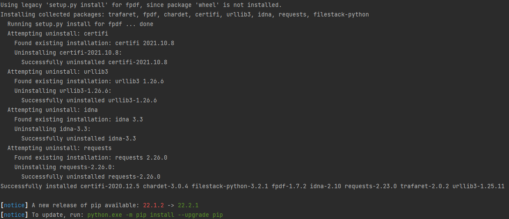

# python-mastery-2-flatmates-bill-sharing

## Title: Flatmates Bill
## Description:
An app that gets as input the amount of a bill for a particular period and the days that each of the flatmates stayed in the house for that period and returns how much each flatmate has to pay. It also generates a PDF Report stating the names of the flatmates, the period, and how much each of them had to pay.

## Objects:
Bill:
- amount
- period

Flatmate:
- name
- days_in_house
- pays(bill)

PdfReport:
- filname
- generate(flatmates, bill)

## Install requirements:
```
certifi==2020.12.5
chardet==3.0.4
filestack-python==3.2.1
fpdf==1.7.2
idna==2.10
requests==2.23.0
trafaret==2.0.2
urllib3==1.25.11

```

How to install requirements:
```
pip install -r requirements.txt
```




Author: [Christian Antony Quero](https://www.linkedin.com/in/christianquero/)